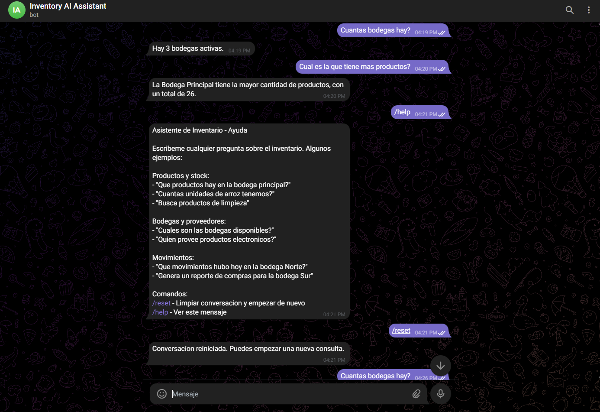

# inventory-ai-bot

Telegram bot that provides a natural-language interface to an inventory management system. Users ask questions in Spanish; the bot forwards them to an AI service and replies with the answer.




## Tech Stack

| Layer | Technology |
|-------|-----------|
| Runtime | Node.js 22 |
| Language | TypeScript 6 |
| Bot framework | [grammY](https://grammy.dev/) 1.42 |
| Dev runner | tsx (watch mode) |
| Build | tsc |

## Features

- `/start` — welcome message with quick-start instructions
- `/help` — usage examples for products, warehouses, suppliers, and movements
- `/reset` — clears the conversation thread so users can start fresh
- Free-text chat — forwards messages to the AI service and replies with the answer
- **Per-chat conversation threads** — each Telegram chat gets its own `threadId` so the AI can maintain context across turns
- **In-memory rate limiting** — configurable message limit per time window (default: 10 messages / 60 s)
- **JWT authentication** — authenticates against the backend on startup and transparently refreshes the token 1 minute before expiry; retries once on 401

## Project Structure

```
src/
├── bot/
│   ├── commands/
│   │   ├── start.ts      # /start handler
│   │   ├── help.ts       # /help handler
│   │   └── reset.ts      # /reset handler
│   ├── handlers/
│   │   └── message.ts    # free-text handler + rate limiting
│   └── bot.ts            # bot factory
├── config/
│   └── env.ts            # typed env var loader (fails fast on missing vars)
├── services/
│   ├── auth-service.ts   # login + token refresh
│   └── ai-service.ts     # chat endpoint client
└── index.ts              # entry point
```

## Environment Variables

Copy `.env.example` to `.env` and fill in the values.

### Required

| Variable | Description |
|----------|-------------|
| `TELEGRAM_BOT_TOKEN` | Token from [@BotFather](https://t.me/BotFather) |
| `AI_SERVICE_URL` | Base URL of the AI service (e.g. `http://localhost:8080`) |
| `BACKEND_URL` | Base URL of the inventory backend (e.g. `http://localhost:3000`) |
| `AI_SERVICE_EMAIL` | Email used to authenticate with the backend |
| `AI_SERVICE_PASSWORD` | Password used to authenticate with the backend |

### Optional

| Variable | Default | Description |
|----------|---------|-------------|
| `RATE_LIMIT_MESSAGES` | `10` | Max messages allowed per window per chat |
| `RATE_LIMIT_WINDOW_MS` | `60000` | Rate-limit window in milliseconds |

## Setup

```bash
npm install
cp .env.example .env
# fill in .env
```

### Development (watch mode with hot reload)

```bash
npm run dev
```

### Production build

```bash
npm run build   # compiles TypeScript to dist/
npm start       # runs dist/index.js
```

## Docker

```bash
docker build -t inventory-ai-bot .
docker run --env-file .env inventory-ai-bot
```

The image is based on `node:22-slim`. It runs `npm ci`, compiles with `npm run build`, and starts with `npm start`.

## API Contracts

The bot depends on two HTTP endpoints:

| Endpoint | Method | Purpose |
|----------|--------|---------|
| `BACKEND_URL/api/v1/auth/login` | POST | Returns a JWT `token` (and optional `expiresAt`) |
| `AI_SERVICE_URL/api/v1/assistant/chat` | POST | Accepts `{ question, threadId }`, returns `{ answer }` |

## Related Repositories

| Repository | Description |
|------------|-------------|
| [inventory-ai-service](https://github.com/nicolerol28/inventory-ai-service) | AI service — Mastra, Gemini, pgvector |
| [inventory-ai-chat](https://github.com/nicolerol28/inventory-ai-chat) | Web chat UI (React) |
| [inventory-system-backend](https://github.com/nicolerol28/inventory-system-backend) | Java Spring Boot backend |
| [inventory-system-frontend](https://github.com/nicolerol28/inventory-system-frontend) | Inventory management UI (React) |